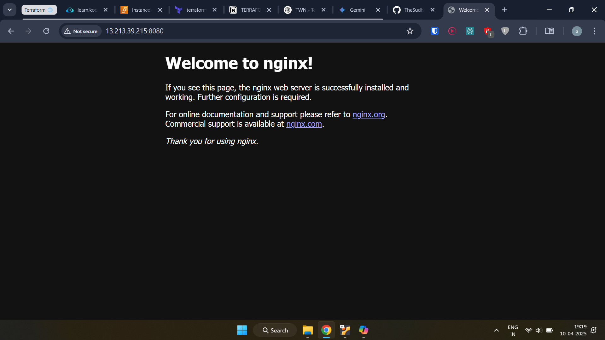

---

# Terraform AWS Infrastructure for Nginx Docker Container

This repository contains Terraform configuration files to automatically provision a basic AWS infrastructure environment. The environment includes a custom VPC, a public subnet, security groups, and an EC2 instance. Upon creation, the EC2 instance is provisioned using remote-exec to install Docker and run a standard Nginx web server container, accessible on port 8080.

**Objective:** To demonstrate infrastructure provisioning on AWS using Terraform, including networking, compute, security, and instance bootstrapping with Docker.

## Proof of Execution (Screenshots)

*( Here is the proof of the Terraform apply success and the running application.)*

**1. Nginx Running on EC2 Server:**

*Description: This screenshot shows the default Nginx welcome page accessed via a web browser using the EC2 instance's public IP address on port 8080 (e.g., `http://<EC2_PUBLIC_IP>:8080`).*



---

## Prerequisites

Before applying this Terraform configuration, ensure you have the following:

1.  **Terraform CLI:** Installed on your local machine (version 1.x or later recommended).
2.  **AWS Account:** An active AWS account.
3.  **AWS Credentials:** Configured AWS credentials for Terraform to interact with your account (e.g., via environment variables `AWS_ACCESS_KEY_ID` and `AWS_SECRET_ACCESS_KEY`, shared credential file `~/.aws/credentials`, or IAM instance profile if running Terraform from EC2). The credentials need permissions to create VPC, Subnet, EC2, Security Group, Key Pair, etc. resources.
4.  **SSH Key Pair:** An existing SSH key pair. You will need the path to both the public key (`.pub`) file and the private key (`.pem` or similar) file.
5.  **Input Variables File:** Create a file named `terraform.tfvars` in the root directory to provide values for the defined variables.

---

## Infrastructure Components

This Terraform configuration provisions the following AWS resources:

1.  **VPC (`aws_vpc`):** Creates a custom Virtual Private Cloud (VPC) with a specified CIDR block.
2.  **Subnet Module (`./modules/subnet`):**
    * **Subnet (`aws_subnet`):** Creates a public subnet within the VPC and specified Availability Zone.
    * **Internet Gateway (`aws_internet_gateway`):** Creates an IGW and attaches it to the VPC.
    * **Route Table (`aws_default_route_table`):** Modifies the default route table associated with the VPC to add a route to the Internet Gateway (`0.0.0.0/0`), making the subnet public.
3.  **Security Group (`aws_security_group`):**
    * Creates a security group (`myapp-sg`) associated with the VPC.
    * Allows **inbound** traffic on port 22 (SSH) only from the IP address specified in `var.my_ip`.
    * Allows **inbound** traffic on port 8080 (Nginx) only from the IP address specified in `var.my_ip`.
    * Allows **outbound** traffic to all destinations (`0.0.0.0/0`) -- *Note: The provided `main.tf` incorrectly restricts outbound to `var.my_ip`; this README assumes the standard `0.0.0.0/0` for typical internet access needs like Docker pulls and OS updates.*
4.  **AMI Data Source (`aws_ami`):** Dynamically finds the latest Amazon Linux 2 AMI ID in the region.
5.  **Key Pair (`aws_key_pair`):** Creates an AWS Key Pair resource using the provided public key file content, allowing SSH access to the EC2 instance.
6.  **EC2 Instance (`aws_instance`):**
    * Launches an EC2 instance using the found AMI ID and specified instance type.
    * Places the instance in the created public subnet.
    * Assigns the security group and key pair.
    * Associates a public IP address.
7.  **Provisioners (`file`, `remote-exec`):**
    * The `file` provisioner uploads the `entry-script.sh` to the EC2 instance after it's created.
    * The `remote-exec` provisioner connects to the instance via SSH (using the provided private key) and executes the uploaded `entry-script.sh` to set up Docker and Nginx.
8.  **Entry Script (`entry-script.sh`):** A bash script executed on the EC2 instance to:
    * Install Docker.
    * Start and enable the Docker service.
    * Adjust Docker socket permissions (using `chmod 666`, see Considerations).
    * Add the default user (`ec2-user`) to the `docker` group.
    * Pull the `nginx` Docker image.
    * Run the Nginx container, mapping host port 8080 to container port 80.

---

## File Structure

* `main.tf`: Defines the main AWS resources (VPC, Security Group, EC2 Instance, Key Pair, AMI lookup) and calls the subnet module.
* `variables.tf`: Declares all input variables used in the configuration.
* `outputs.tf`: Defines the output values (AMI ID, EC2 Public IP) displayed after successful application.
* `entry-script.sh`: The shell script executed on the EC2 instance by the provisioner.
* `modules/subnet/main.tf`: Contains the resources specific to creating the public subnet (Subnet, IGW, Route Table configuration).
* `terraform.tfvars` (You need to create this): Contains the specific values for the variables defined in `variables.tf`.

---

## How to Run

1.  **Clone the Repository:**
    ```bash
    git clone <your-repo-url>
    cd <your-repo-directory>
    ```
2.  **Create `terraform.tfvars`:** Create a file named `terraform.tfvars` in the root directory and populate it with values for your environment. Use your actual public/private key paths and your current public IP address (you can find it by searching "what is my ip" in Google).

    **Example `terraform.tfvars`:**
    ```hcl
    vpc_cidr_block       = "10.0.0.0/16"
    subnet_cidr_block    = "10.0.10.0/24"
    avail_zone           = "ap-south-1a" # Choose an AZ in your desired region
    env_prefix           = "dev"
    my_ip                = "YOUR_PUBLIC_IP/32" # e.g., "85.246.32.98/32"
    instance_type        = "t2.micro"
    public_key_location  = "~/.ssh/id_rsa.pub" # Path to your public key
    private_key_location = "~/.ssh/id_rsa"     # Path to your private key
    ```
3.  **Initialize Terraform:** Download necessary provider plugins.
    ```bash
    terraform init
    ```
4.  **Plan Changes:** Review the infrastructure changes Terraform proposes.
    ```bash
    terraform plan
    ```
5.  **Apply Changes:** Provision the AWS resources. Type `yes` when prompted.
    ```bash
    terraform apply
    ```
    Wait for the command to complete. The EC2 instance provisioning (including running the script) will take a few minutes. Note the `ec2_public_ip` output value.

6.  **Access Nginx:** Open your web browser and navigate to `http://<EC2_PUBLIC_IP>:8080` (replace `<EC2_PUBLIC_IP>` with the output value). You should see the Nginx welcome page.

7.  **Clean Up (Destroy Infrastructure):** When finished, destroy the created resources to avoid ongoing charges. Type `yes` when prompted.
    ```bash
    terraform destroy
    ```

---

## Inputs (`variables.tf`)

| Variable Name           | Description                                      | Type   | Default | Required |
| :---------------------- | :----------------------------------------------- | :----- | :------ | :------- |
| `vpc_cidr_block`        | CIDR block for the VPC.                          | string | -       | Yes      |
| `subnet_cidr_block`     | CIDR block for the public subnet.                | string | -       | Yes      |
| `avail_zone`            | Availability Zone for the subnet and EC2.        | string | -       | Yes      |
| `env_prefix`            | Prefix for naming resources (e.g., "dev", "prod"). | string | -       | Yes      |
| `my_ip`                 | Your public IP address (CIDR format) for SG rules. | string | -       | Yes      |
| `instance_type`         | EC2 instance type (e.g., "t2.micro").            | string | -       | Yes      |
| `public_key_location`   | Path to your SSH public key file (.pub).         | string | -       | Yes      |
| `private_key_location`  | Path to your SSH private key file (.pem, etc.).  | string | -       | Yes      |

---

## Outputs (`outputs.tf`)

| Output Name     | Description                               |
| :-------------- | :---------------------------------------- |
| `aws_ami_id`    | The ID of the Amazon Linux 2 AMI used.    |
| `ec2_public_ip` | The public IP address of the EC2 instance. |

-
